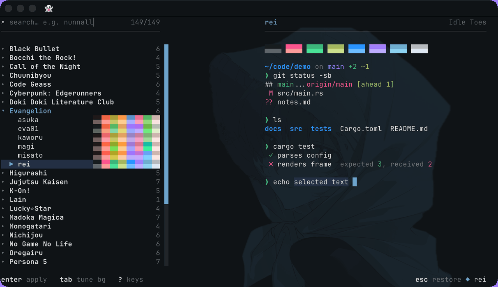

<h1 align="center">ttheme</h1>

<p align="center"><em>Character terminal palettes — readable by rule, switched live, one tab at a time.</em></p>

<p align="center">
  <a href="https://www.npmjs.com/package/@kecan0406/ttheme"></a>
  <a href="https://github.com/kecan0406/ttheme/actions/workflows/ci.yml"></a>
  <a href="https://kecan0406.github.io/ttheme/"></a>
  <a href="LICENSE"></a>
</p>

<p align="center">
  <a href="https://kecan0406.github.io/ttheme/">Site</a> ·
  <a href="#palettes">Palettes</a> ·
  <a href="docs/usage.md">Usage</a> ·
  <a href="docs/terminals.md">Terminals</a> ·
  <a href="CONTRIBUTING.md">Contributing</a>
</p>

<p align="center">
  
</p>

## Why ttheme

- **Colors from the character.** Every palette keeps the three colors that
  identify its character and borrows its ANSI ramp from an established scheme,
  harmonized so the whole catalog reads alike.
- **Every palette passes an accessibility gate.** Body text at 7:1 against the
  background (WCAG AAA), every meaningful ANSI color at 3:1, and each accent stays
  in its role — red reads as an error, green as success. The build fails if a
  palette regresses.
- **Switched live, per tab.** Tabs in one window can wear different palettes,
  any tab can be repainted at any time, a directory can pin its own, and a new
  tab can take the next character.

## Quick start

```sh
npx @kecan0406/ttheme@latest init
```

It asks which terminals to wire and which series to install, shows every file it
is about to change, and writes nothing until you confirm. Then:

```sh
exec zsh               # the ttheme command in this tab
ttheme preview         # browse live — the tab repaints as the cursor moves
```

<details>
<summary><b>What init changes</b></summary>

- Your terminal config and `~/.zshrc` get a block between `# ttheme begin` /
  `# ttheme end`; everything outside it is left alone, and what goes in is
  colors only — no font, font size or shader.
- Each file is backed up once to `<file>.ttheme.bak` before the first edit, and
  written through symlinks, so a dotfiles repo keeps its links.
- A key you set yourself stays yours, and every file ttheme adds to a terminal's
  folders is named `ttheme-<palette>`.
- `npx @kecan0406/ttheme@latest uninstall` lists and then reverses all of it.

Per-terminal details, manual install from the release archives and building from
a checkout are in [docs/install.md](docs/install.md).

</details>

## Palettes

<p align="center">
  <a href="https://kecan0406.github.io/ttheme/"></a>
</p>

<details>
<summary><b>Every palette</b></summary>
<br>

</details>

Both images are drawn from the live catalog, so they always match what
`ttheme browse` offers. `init` installs the series you pick; `ttheme browse`
adds or drops single palettes any time, and a merged palette reaches everyone
through `ttheme update` without waiting for a release.

### Markets

Anyone can publish palettes from a GitHub repository. A market is named
`<owner>@<name>` — its repository's owner and the name its index gives — and
sits below the series in `ttheme preview` and `ttheme browse`, past a line:

```
▾ Evangelion
    rei
    asuka
── markets ──────────
▾ alice@pastel
    dusk
    rei
```

```sh
ttheme market search                  # repositories with the ttheme-market topic
ttheme market add alice/ttheme-pastel # or a folder
ttheme add alice@pastel/dusk
```

Nobody reviews a market. Its palettes are colors and post numbers, never code,
and the contrast gate's numbers are shown for them but never enforced — only
the official catalog is held to the gate. `ttheme update` refreshes every
market; `ttheme market remove alice@pastel` drops one, and the palettes you
installed from it keep working. The official catalog is a market too
(`official`). [The markets page](https://kecan0406.github.io/ttheme/markets)
lists the public ones.

### Your own palettes

`ttheme new rei --from rei` makes `<you>@<market>/rei`, named after your GitHub
handle and a market name the first `new` asks for, in
`~/.config/ttheme/market/<market>`, and installs it. `ttheme edit rei` opens it
in `$EDITOR`; `ttheme check --fix` suggests colors that pass the gate.

A local market is already a repository layout: `palettes/*.toml`, the
`ttheme-market.json` index and a workflow that rebuilds the index on every
push. `ttheme market init <name>` makes one and prints the commands that
publish it:

```sh
cd ~/.config/ttheme/market/<name>
git init -b main && git add -A && git commit -m "<you>@<name>"
gh repo create <you>/ttheme-<name> --public --source . --push
gh repo edit <you>/ttheme-<name> --add-topic ttheme-market
```

`ttheme share <palette>` prints a code — `tt1:…`, about 200 characters — that
carries the colors and the numbers of its background posts with their framing.
`ttheme add tt1:…` installs it anywhere without a market, fetching those posts
from the booru the way `find` does.

## Usage

| Command | |
|---|---|
| `ttheme preview` | browse live — the tab repaints as the cursor moves, enter applies it to this tab or makes it the default |
| `ttheme use <palette>` | paint this tab (a unique prefix works) |
| `ttheme next` | advance this tab to the next palette |
| `ttheme default <palette>` | the palette new tabs open with |
| `ttheme pin` / `unpin` | a palette for this directory — `cd` in repaints, `cd` out restores |
| `ttheme browse` | pick palettes from the catalog |
| `ttheme market add <owner/repo>` | add someone's market — `ttheme market` lists yours; `search`, `remove` too |
| `ttheme new <name> --from <palette>` | make a palette of your own; `edit`, `check`, `share` follow |
| `ttheme on` / `off` | wear the default again / give the terminal its own colors back |
| `ttheme config` | settings in `$EDITOR` |

`ttheme help` shows the three to start with and the rest by task; `ttheme help
all` lists every command. Preview's keys, directory pins, rotating new
tabs and every setting are in [docs/usage.md](docs/usage.md).

## Terminal support

| | Ghostty | iTerm2 | kitty | Alacritty | WezTerm | Windows Terminal | Warp | Terminal.app |
|---|:---:|:---:|:---:|:---:|:---:|:---:|:---:|:---:|
| **Setup with `init`** | ✅ | ✅ | ✅ | ✅ | ✅ | ✅ | ✅ | — |
| **Runtime repaint** | ✅ | ✅ | ✅ | ✅ | ✅ | ✅ | — | ✅ |
| **Background pictures** | ✅ | ✅ | ✅ | — | ◐ | — | — | — |

Nothing is emulated — a terminal that cannot express something does not get it.
Any other terminal that speaks OSC 4/10/11 gets runtime repainting. Why each cell
is what it is: [docs/terminals.md](docs/terminals.md).

## Background pictures

A palette can wear a picture behind the text. ttheme ships none: `ttheme
preview` → tab searches danbooru, konachan and yande.re for the character live
(safe-rated by default), or takes a picture you paste or drop, cuts the
character out on macOS, tints it to the palette and installs it on your machine
only. Ghostty shows the focused tab's picture, iTerm2 one per tab, kitty one per
window. See [docs/backgrounds.md](docs/backgrounds.md).

## Contributing

A palette is one TOML file of color values and post numbers — never images.
Your own go in your own market, with no review; the official catalog takes pull
requests, and [CONTRIBUTING.md](CONTRIBUTING.md) has its rules, the file format
and the checks a palette must pass.

## Credits

Base ANSI ramps come from
[mbadolato/iTerm2-Color-Schemes](https://github.com/mbadolato/iTerm2-Color-Schemes)
(MIT), whose notice keeps each individual scheme's copyright with its own
author. Two palettes are sourced directly instead: `miku` from
[vauxe/hatsune-miku-theme](https://github.com/vauxe/hatsune-miku-theme) (MIT)
and `magi` from [lotap/magi-theme](https://github.com/lotap/magi-theme) (MIT).
Every palette records its input in `meta.ansi_source`, and only that input's
hues survive: the harmonizer normalizes lightness and saturation away and
rotates each non-signature hue toward the palette's own seed, so no scheme is
reproduced here.

Palettes are inspired by characters from the listed works; this project is
unaffiliated with and unendorsed by their rights holders. No character art,
audio or trademarked asset is redistributed here — only color values.
Terminal background images are downloaded from the booru you pick only when you
ask `find` for one, built on your own machine and written to
`~/.config/ttheme/backgrounds/`; none ship in this repository or on npm.

## License

[MIT](LICENSE)
